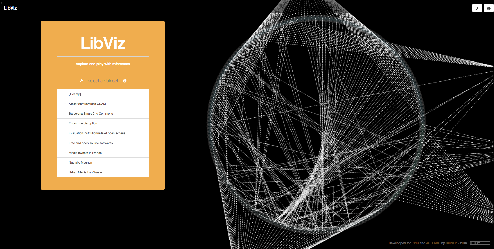
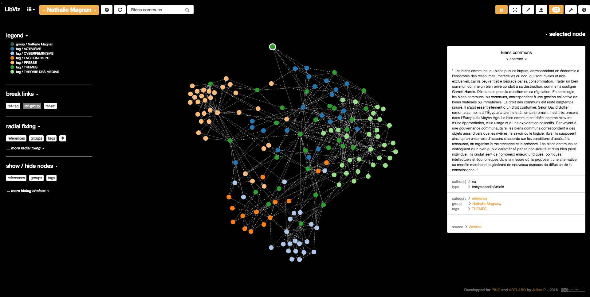

                  
<h4 align=center>
LibViz : <a href="http://libviz.artlabo.org">libviz.artlabo.org</a>
</h4>

<h2 align=center>
    Making graphs you can play with  from any Zotero library..
</h2>

<h2 align=center>
	
     
	
</h2>

-------------------------------------------------------
## PRESENTATION

LibViz allows to generate data visualisations (graphs) from sets of Zotero references.

------------
##HISTORY

LibViz started as a part of [1.CAMP](http://www.pingbase.net/activites/1-camp), which a larger project aiming to cross different topics as the anthropocene era, art, new practices, scientific research, ... Julien Bellanger from [PING](http://www.pingbase.net/) could tell more about this part...

Then other people join the project, wanting some visualisation for their own datasets : other bibliographical references gathered in [Zotero](https://www.zotero.org/). So the project eventually aimed to be as 'neutral' as possible to accept any kind of dataset from Zotero.

-------------------------------------------------------
## UNDER THE HOOD

LibViz development is documented here.

LibViz is powered by :

- [**Python**](https://www.python.org/) to get the references and create the JSON datasets
- [**Zotero**](https://www.zotero.org/) to organise bibliographical references
- [**Flask**](http://flask.pocoo.org/) as backbone of the website
- [**Bootstrap**](https://getbootstrap.com/) for the global aspect website
- [**d3.js**](https://d3js.org/) by Mike Bostock to create the graph visualisation

-------------------------------------------------------
## CREDITS

Project by [PING](http://www.pingbase.net/) / [ARTLABO](http://artlabo.org/) and developped by Julien P with the precious help of Julien B., Benjamin C., Ewen C., Xavier from Bureau d'études

This application is inspired by a previous work called "[Constellations bibliographiques](http://www.laurent-malys.fr/sur-les-epaules-de-darwin/)" developped by [Laurent Malys](http://www.laurent-malys.fr/a-propos/).

-------------------------------------------------------
## VIRTUALENV CONFIGURATION

To develop & test this application, you can use a Python “virtualenv”. To proceed, just install the Debian package `python-virtualenv`, create a new “virtualenv”, activate it and then install the required dependencies:

    $ sudo apt install python-virtualenv
    $ cd LibViz
    $ virtualenv venv
    $ source venv/bin/activate
    $ pip install -r requirements.txt
    $ python run.py

-------------------------------------------------------
## APACHE CONFIGURATION

To deploy this application with Apache2, you have to install `mod_wsgi` (available in Debian in the `libapache2-mod-wsgi` package). You can then add the following snippet in your VirtualHost’s configuration:

    DocumentRoot "/home/artlabo/www/libviz.artlabo.org/LibViz"

    WSGIDaemonProcess libviz user=artlabo group=artlabo threads=5 python-home=/home/artlabo/www/libviz.artlabo.org/LibViz/venv python-pat$
    WSGIScriptAlias / /home/artlabo/www/libviz.artlabo.org/LibViz/libviz.wsgi

    <Directory /home/artlabo/www/libviz.artlabo.org/LibViz/>
            WSGIProcessGroup libviz
            WSGIApplicationGroup %{GLOBAL}
            Require all granted
            AllowOverride All
            #Order deny,allow
            #Allow from all
    </Directory>

This configuration requires to install a Python “virtualenv” in `/home/artlabo/www/libviz.artlabo.org/LibViz/venv`.

Apache server should be reloaded after each code change.

-------------------------------------------------------
## START LIBVIZ (Flask)

LibViz uses [Flask](http://flask.pocoo.org/) to work. 
With the above configuration, restarting apache will start Flask and so the LibViz app.

-------------------------------------------------------
## LICENCE :  Creative Commons License

LibViz is licensed under a [Creative Commons Attribution 4.0 International License](https://creativecommons.org/licenses/by/4.0/deed.fr) .
